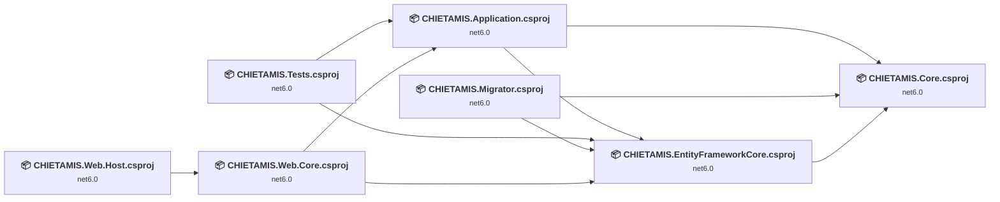
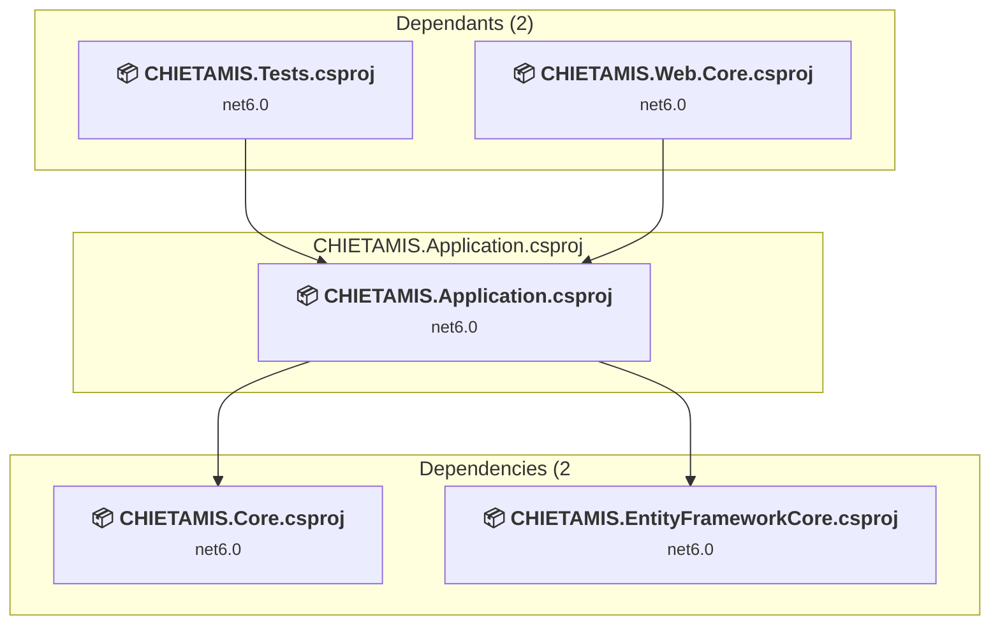
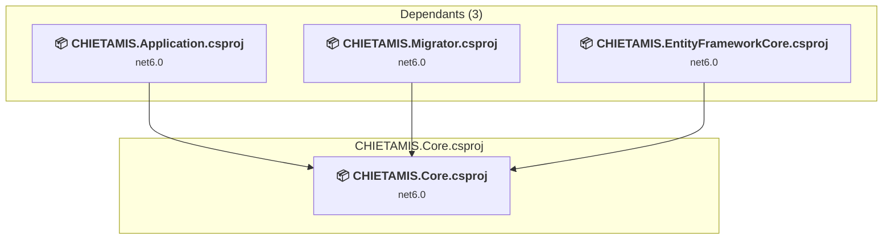
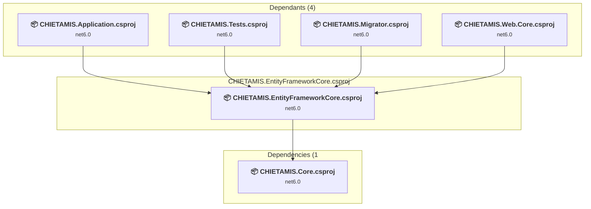
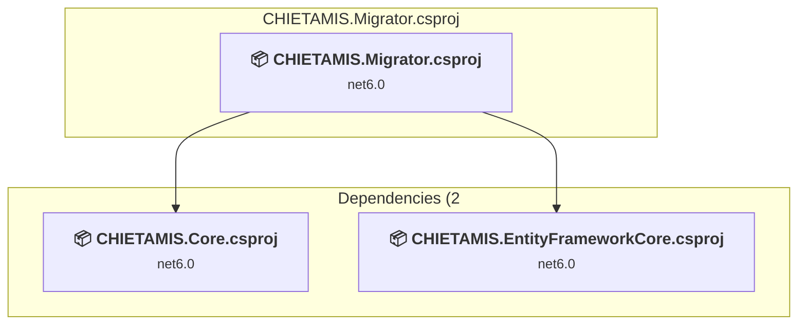
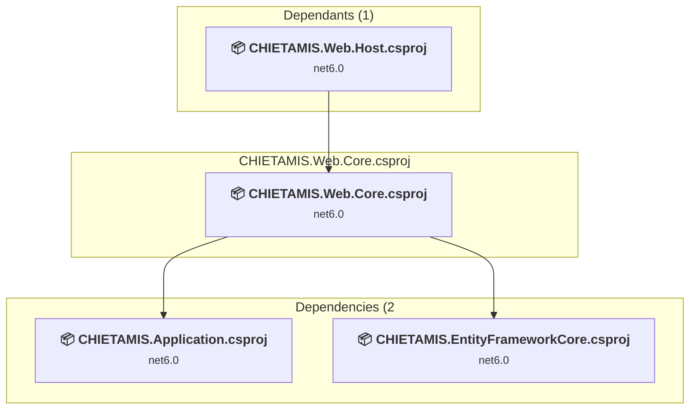
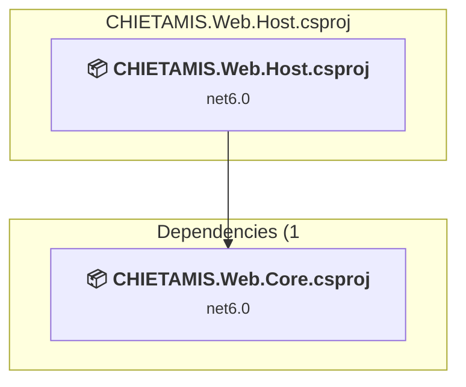
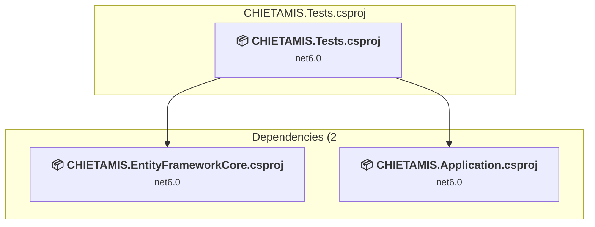

# Projects and dependencies analysis

This document provides a comprehensive overview of the projects and their dependencies in the context of upgrading to .NETCoreApp,Version=v10.0.

## Table of Contents

- [Executive Summary](#executive-Summary)
  - [Highlevel Metrics](#highlevel-metrics)
  - [Projects Compatibility](#projects-compatibility)
  - [Package Compatibility](#package-compatibility)
  - [API Compatibility](#api-compatibility)
- [Aggregate NuGet packages details](#aggregate-nuget-packages-details)
- [Top API Migration Challenges](#top-api-migration-challenges)
  - [Technologies and Features](#technologies-and-features)
  - [Most Frequent API Issues](#most-frequent-api-issues)
- [Projects Relationship Graph](#projects-relationship-graph)
- [Project Details](#project-details)

  - [src\CHIETAMIS.Application\CHIETAMIS.Application.csproj](#srcchietamisapplicationchietamisapplicationcsproj)
  - [src\CHIETAMIS.Core\CHIETAMIS.Core.csproj](#srcchietamiscorechietamiscorecsproj)
  - [src\CHIETAMIS.EntityFrameworkCore\CHIETAMIS.EntityFrameworkCore.csproj](#srcchietamisentityframeworkcorechietamisentityframeworkcorecsproj)
  - [src\CHIETAMIS.Migrator\CHIETAMIS.Migrator.csproj](#srcchietamismigratorchietamismigratorcsproj)
  - [src\CHIETAMIS.Web.Core\CHIETAMIS.Web.Core.csproj](#srcchietamiswebcorechietamiswebcorecsproj)
  - [src\CHIETAMIS.Web.Host\CHIETAMIS.Web.Host.csproj](#srcchietamiswebhostchietamiswebhostcsproj)
  - [test\CHIETAMIS.Tests\CHIETAMIS.Tests.csproj](#testchietamistestschietamistestscsproj)

## Executive Summary

### Highlevel Metrics

| Metric | Count | Status |
| :--- | :---: | :--- |
| Total Projects | 7 | All require upgrade |
| Total NuGet Packages | 39 | 8 need upgrade |
| Total Code Files | 957 |  |
| Total Code Files with Incidents | 19 |  |
| Total Lines of Code | 105190 |  |
| Total Number of Issues | 98 |  |
| Estimated LOC to modify | 64+ | at least 0.1% of codebase |

### Projects Compatibility

| Project | Target Framework | Difficulty | Package Issues | API Issues | Est. LOC Impact | Description |
| :--- | :---: | :---: | :---: | :---: | :---: | :--- |
| [src\CHIETAMIS.Application\CHIETAMIS.Application.csproj](#srcchietamisapplicationchietamisapplicationcsproj) | net6.0 | 🟢 Low | 5 | 3 | 3+ | ClassLibrary, Sdk Style = True |
| [src\CHIETAMIS.Core\CHIETAMIS.Core.csproj](#srcchietamiscorechietamiscorecsproj) | net6.0 | 🟢 Low | 3 | 6 | 6+ | ClassLibrary, Sdk Style = True |
| [src\CHIETAMIS.EntityFrameworkCore\CHIETAMIS.EntityFrameworkCore.csproj](#srcchietamisentityframeworkcorechietamisentityframeworkcorecsproj) | net6.0 | 🟢 Low | 5 | 0 |  | ClassLibrary, Sdk Style = True |
| [src\CHIETAMIS.Migrator\CHIETAMIS.Migrator.csproj](#srcchietamismigratorchietamismigratorcsproj) | net6.0 | 🟢 Low | 3 | 0 |  | DotNetCoreApp, Sdk Style = True |
| [src\CHIETAMIS.Web.Core\CHIETAMIS.Web.Core.csproj](#srcchietamiswebcorechietamiswebcorecsproj) | net6.0 | 🟢 Low | 4 | 12 | 12+ | ClassLibrary, Sdk Style = True |
| [src\CHIETAMIS.Web.Host\CHIETAMIS.Web.Host.csproj](#srcchietamiswebhostchietamiswebhostcsproj) | net6.0 | 🟢 Low | 3 | 42 | 42+ | AspNetCore, Sdk Style = True |
| [test\CHIETAMIS.Tests\CHIETAMIS.Tests.csproj](#testchietamistestschietamistestscsproj) | net6.0 | 🟢 Low | 4 | 1 | 1+ | DotNetCoreApp, Sdk Style = True |

### Package Compatibility

| Status | Count | Percentage |
| :--- | :---: | :---: |
| ✅ Compatible | 31 | 79.5% |
| ⚠️ Incompatible | 2 | 5.1% |
| 🔄 Upgrade Recommended | 6 | 15.4% |
| ***Total NuGet Packages*** | ***39*** | ***100%*** |

### API Compatibility

| Category | Count | Impact |
| :--- | :---: | :--- |
| 🔴 Binary Incompatible | 12 | High - Require code changes |
| 🟡 Source Incompatible | 27 | Medium - Needs re-compilation and potential conflicting API error fixing |
| 🔵 Behavioral change | 25 | Low - Behavioral changes that may require testing at runtime |
| ✅ Compatible | 161207 |  |
| ***Total APIs Analyzed*** | ***161271*** |  |

## Aggregate NuGet packages details

| Package | Current Version | Suggested Version | Projects | Description |
| :--- | :---: | :---: | :--- | :--- |
| Abp.AspNetCore | 7.0.0 |  | [CHIETAMIS.Web.Core.csproj](#srcchietamiswebcorechietamiswebcorecsproj) | ✅Compatible |
| Abp.AspNetCore.SignalR | 7.0.0 |  | [CHIETAMIS.Web.Core.csproj](#srcchietamiswebcorechietamiswebcorecsproj) | ✅Compatible |
| Abp.AutoMapper | 7.0.0 |  | [CHIETAMIS.Core.csproj](#srcchietamiscorechietamiscorecsproj) | ✅Compatible |
| Abp.Castle.Log4Net | 7.0.0 |  | [CHIETAMIS.Migrator.csproj](#srcchietamismigratorchietamismigratorcsproj) [CHIETAMIS.Web.Host.csproj](#srcchietamiswebhostchietamiswebhostcsproj) | ✅Compatible |
| Abp.MailKit | 7.2.1 |  | [CHIETAMIS.Core.csproj](#srcchietamiscorechietamiscorecsproj) | ✅Compatible |
| Abp.TestBase | 7.0.0 |  | [CHIETAMIS.Tests.csproj](#testchietamistestschietamistestscsproj) | ✅Compatible |
| Abp.ZeroCore | 7.0.0 |  | [CHIETAMIS.Web.Core.csproj](#srcchietamiswebcorechietamiswebcorecsproj) | ✅Compatible |
| Abp.ZeroCore.EntityFrameworkCore | 7.0.0 |  | [CHIETAMIS.Core.csproj](#srcchietamiscorechietamiscorecsproj) | ✅Compatible |
| AWSSDK.Textract | 4.0.0.4 |  | [CHIETAMIS.Application.csproj](#srcchietamisapplicationchietamisapplicationcsproj) [CHIETAMIS.Web.Host.csproj](#srcchietamiswebhostchietamiswebhostcsproj) | ✅Compatible |
| Castle.Core | 4.4.1 |  | [CHIETAMIS.Tests.csproj](#testchietamistestschietamistestscsproj) | ✅Compatible |
| Castle.Windsor.MsDependencyInjection | 3.4.0 |  | [CHIETAMIS.Core.csproj](#srcchietamiscorechietamiscorecsproj) | ✅Compatible |
| Dapper | 2.0.123 |  | [CHIETAMIS.Application.csproj](#srcchietamisapplicationchietamisapplicationcsproj) | ✅Compatible |
| DtronixPdf | 1.1.3 |  | [CHIETAMIS.Application.csproj](#srcchietamisapplicationchietamisapplicationcsproj) | ✅Compatible |
| EPPlus | 7.0.9 |  | [CHIETAMIS.Application.csproj](#srcchietamisapplicationchietamisapplicationcsproj) | ✅Compatible |
| H.InputSimulator | 1.5.0 |  | [CHIETAMIS.Core.csproj](#srcchietamiscorechietamiscorecsproj) | ✅Compatible |
| itext | 9.1.0 |  | [CHIETAMIS.Application.csproj](#srcchietamisapplicationchietamisapplicationcsproj) | ✅Compatible |
| iTextSharp | 5.5.13.4 | 5.5.13.3 | [CHIETAMIS.Application.csproj](#srcchietamisapplicationchietamisapplicationcsproj) | ⚠️NuGet package is incompatible |
| Magick.NET.Core | 14.4.0 |  | [CHIETAMIS.Application.csproj](#srcchietamisapplicationchietamisapplicationcsproj) | ✅Compatible |
| Microsoft.AspNetCore.Authentication.JwtBearer | 6.0.0 | 10.0.5 | [CHIETAMIS.Web.Core.csproj](#srcchietamiswebcorechietamiswebcorecsproj) | NuGet package upgrade is recommended |
| Microsoft.Diagnostics.Tracing.TraceEvent | 3.1.18 |  | [CHIETAMIS.Application.csproj](#srcchietamisapplicationchietamisapplicationcsproj) | ✅Compatible |
| Microsoft.EntityFrameworkCore | 6.0.1 | 10.0.5 | [CHIETAMIS.Application.csproj](#srcchietamisapplicationchietamisapplicationcsproj) [CHIETAMIS.Core.csproj](#srcchietamiscorechietamiscorecsproj) [CHIETAMIS.EntityFrameworkCore.csproj](#srcchietamisentityframeworkcorechietamisentityframeworkcorecsproj) [CHIETAMIS.Migrator.csproj](#srcchietamismigratorchietamismigratorcsproj) [CHIETAMIS.Tests.csproj](#testchietamistestschietamistestscsproj) [CHIETAMIS.Web.Core.csproj](#srcchietamiswebcorechietamiswebcorecsproj) [CHIETAMIS.Web.Host.csproj](#srcchietamiswebhostchietamiswebhostcsproj) | NuGet package upgrade is recommended |
| Microsoft.EntityFrameworkCore.Design | 6.0.1 | 10.0.5 | [CHIETAMIS.Application.csproj](#srcchietamisapplicationchietamisapplicationcsproj) [CHIETAMIS.Core.csproj](#srcchietamiscorechietamiscorecsproj) [CHIETAMIS.EntityFrameworkCore.csproj](#srcchietamisentityframeworkcorechietamisentityframeworkcorecsproj) [CHIETAMIS.Migrator.csproj](#srcchietamismigratorchietamismigratorcsproj) [CHIETAMIS.Tests.csproj](#testchietamistestschietamistestscsproj) [CHIETAMIS.Web.Core.csproj](#srcchietamiswebcorechietamiswebcorecsproj) [CHIETAMIS.Web.Host.csproj](#srcchietamiswebhostchietamiswebhostcsproj) | NuGet package upgrade is recommended |
| Microsoft.EntityFrameworkCore.InMemory | 6.0.0 | 10.0.5 | [CHIETAMIS.Tests.csproj](#testchietamistestschietamistestscsproj) | NuGet package upgrade is recommended |
| Microsoft.EntityFrameworkCore.SqlServer | 6.0.0 | 10.0.5 | [CHIETAMIS.EntityFrameworkCore.csproj](#srcchietamisentityframeworkcorechietamisentityframeworkcorecsproj) | NuGet package upgrade is recommended |
| Microsoft.EntityFrameworkCore.Tools | 6.0.0 | 10.0.5 | [CHIETAMIS.EntityFrameworkCore.csproj](#srcchietamisentityframeworkcorechietamisentityframeworkcorecsproj) | NuGet package upgrade is recommended |
| Microsoft.NET.Test.Sdk | 17.0.0 |  | [CHIETAMIS.Tests.csproj](#testchietamistestschietamistestscsproj) | ✅Compatible |
| Microsoft.NETCore.Platforms | 6.0.1 |  | [CHIETAMIS.Application.csproj](#srcchietamisapplicationchietamisapplicationcsproj) [CHIETAMIS.Core.csproj](#srcchietamiscorechietamiscorecsproj) [CHIETAMIS.EntityFrameworkCore.csproj](#srcchietamisentityframeworkcorechietamisentityframeworkcorecsproj) [CHIETAMIS.Migrator.csproj](#srcchietamismigratorchietamismigratorcsproj) [CHIETAMIS.Tests.csproj](#testchietamistestschietamistestscsproj) [CHIETAMIS.Web.Core.csproj](#srcchietamiswebcorechietamiswebcorecsproj) [CHIETAMIS.Web.Host.csproj](#srcchietamiswebhostchietamiswebhostcsproj) | NuGet package functionality is included with framework reference |
| NSubstitute | 4.2.2 |  | [CHIETAMIS.Tests.csproj](#testchietamistestschietamistestscsproj) | ✅Compatible |
| PdfiumViewer | 2.13.0 |  | [CHIETAMIS.Application.csproj](#srcchietamisapplicationchietamisapplicationcsproj) | ⚠️NuGet package is incompatible |
| PdfPig | 0.1.10 |  | [CHIETAMIS.Application.csproj](#srcchietamisapplicationchietamisapplicationcsproj) | ✅Compatible |
| PDFsharp | 6.1.1 |  | [CHIETAMIS.Application.csproj](#srcchietamisapplicationchietamisapplicationcsproj) | ✅Compatible |
| SautinSoft.Document | 2025.5.6 |  | [CHIETAMIS.Application.csproj](#srcchietamisapplicationchietamisapplicationcsproj) | ✅Compatible |
| Shouldly | 4.0.3 |  | [CHIETAMIS.Tests.csproj](#testchietamistestschietamistestscsproj) | ✅Compatible |
| Swashbuckle.AspNetCore | 6.2.3 |  | [CHIETAMIS.Web.Core.csproj](#srcchietamiswebcorechietamiswebcorecsproj) | ✅Compatible |
| Tesseract | 5.2.0 |  | [CHIETAMIS.Core.csproj](#srcchietamiscorechietamiscorecsproj) | ✅Compatible |
| Twilio | 5.75.0 |  | [CHIETAMIS.Core.csproj](#srcchietamiscorechietamiscorecsproj) | ✅Compatible |
| xunit | 2.4.1 |  | [CHIETAMIS.Tests.csproj](#testchietamistestschietamistestscsproj) | ✅Compatible |
| xunit.extensibility.execution | 2.4.1 |  | [CHIETAMIS.Tests.csproj](#testchietamistestschietamistestscsproj) | ✅Compatible |
| xunit.runner.visualstudio | 2.4.3 |  | [CHIETAMIS.Tests.csproj](#testchietamistestschietamistestscsproj) | ✅Compatible |

## Top API Migration Challenges

### Technologies and Features

| Technology | Issues | Percentage | Migration Path |
| :--- | :---: | :---: | :--- |
| IdentityModel & Claims-based Security | 11 | 17.2% | Windows Identity Foundation (WIF), SAML, and claims-based authentication APIs that have been replaced by modern identity libraries. WIF was the original identity framework for .NET Framework. Migrate to Microsoft.IdentityModel.* packages (modern identity stack). |
| Legacy Configuration System | 6 | 9.4% | Legacy XML-based configuration system (app.config/web.config) that has been replaced by a more flexible configuration model in .NET Core. The old system was rigid and XML-based. Migrate to Microsoft.Extensions.Configuration with JSON/environment variables; use System.Configuration.ConfigurationManager NuGet package as interim bridge if needed. |

### Most Frequent API Issues

| API | Count | Percentage | Category |
| :--- | :---: | :---: | :--- |
| T:System.Net.Http.HttpContent | 12 | 18.8% | Behavioral Change |
| T:System.Uri | 8 | 12.5% | Behavioral Change |
| T:System.IdentityModel.Tokens.Jwt.JwtRegisteredClaimNames | 3 | 4.7% | Binary Incompatible |
| T:Microsoft.AspNetCore.Hosting.IWebHost | 3 | 4.7% | Source Incompatible |
| T:Microsoft.AspNetCore.Authentication.ISystemClock | 2 | 3.1% | Source Incompatible |
| T:System.Net.ServicePointManager | 2 | 3.1% | Source Incompatible |
| M:System.Net.Http.HttpContent.ReadAsStreamAsync | 2 | 3.1% | Behavioral Change |
| M:System.Uri.#ctor(System.String) | 2 | 3.1% | Behavioral Change |
| T:Microsoft.AspNetCore.Authentication.JwtBearer.JwtBearerEvents | 2 | 3.1% | Source Incompatible |
| M:System.TimeSpan.FromMinutes(System.Double) | 1 | 1.6% | Source Incompatible |
| F:System.IdentityModel.Tokens.Jwt.JwtRegisteredClaimNames.Iat | 1 | 1.6% | Binary Incompatible |
| F:System.IdentityModel.Tokens.Jwt.JwtRegisteredClaimNames.Jti | 1 | 1.6% | Binary Incompatible |
| F:System.IdentityModel.Tokens.Jwt.JwtRegisteredClaimNames.Sub | 1 | 1.6% | Binary Incompatible |
| T:System.IdentityModel.Tokens.Jwt.JwtSecurityTokenHandler | 1 | 1.6% | Binary Incompatible |
| M:System.IdentityModel.Tokens.Jwt.JwtSecurityTokenHandler.#ctor | 1 | 1.6% | Binary Incompatible |
| M:System.IdentityModel.Tokens.Jwt.JwtSecurityTokenHandler.WriteToken(Microsoft.IdentityModel.Tokens.SecurityToken) | 1 | 1.6% | Binary Incompatible |
| T:System.IdentityModel.Tokens.Jwt.JwtSecurityToken | 1 | 1.6% | Binary Incompatible |
| M:System.IdentityModel.Tokens.Jwt.JwtSecurityToken.#ctor(System.String,System.String,System.Collections.Generic.IEnumerable{System.Security.Claims.Claim},System.Nullable{System.DateTime},System.Nullable{System.DateTime},Microsoft.IdentityModel.Tokens.SigningCredentials) | 1 | 1.6% | Binary Incompatible |
| M:System.TimeSpan.FromDays(System.Double) | 1 | 1.6% | Source Incompatible |
| T:System.Configuration.ConfigurationManager | 1 | 1.6% | Source Incompatible |
| T:System.Configuration.ConnectionStringSettingsCollection | 1 | 1.6% | Source Incompatible |
| P:System.Configuration.ConfigurationManager.ConnectionStrings | 1 | 1.6% | Source Incompatible |
| T:System.Configuration.ConnectionStringSettings | 1 | 1.6% | Source Incompatible |
| P:System.Configuration.ConnectionStringSettingsCollection.Item(System.String) | 1 | 1.6% | Source Incompatible |
| P:System.Configuration.ConnectionStringSettings.ConnectionString | 1 | 1.6% | Source Incompatible |
| T:Microsoft.AspNetCore.WebHost | 1 | 1.6% | Source Incompatible |
| M:Microsoft.Extensions.Configuration.ConfigurationBinder.GetValue''1(Microsoft.Extensions.Configuration.IConfiguration,System.String) | 1 | 1.6% | Binary Incompatible |
| M:Microsoft.Extensions.DependencyInjection.HttpClientFactoryServiceCollectionExtensions.AddHttpClient(Microsoft.Extensions.DependencyInjection.IServiceCollection,System.String) | 1 | 1.6% | Behavioral Change |
| T:Microsoft.AspNetCore.Authentication.JwtBearer.MessageReceivedContext | 1 | 1.6% | Source Incompatible |
| P:Microsoft.AspNetCore.Authentication.JwtBearer.MessageReceivedContext.Token | 1 | 1.6% | Source Incompatible |
| P:Microsoft.AspNetCore.Authentication.JwtBearer.JwtBearerEvents.OnMessageReceived | 1 | 1.6% | Source Incompatible |
| M:Microsoft.AspNetCore.Authentication.JwtBearer.JwtBearerEvents.#ctor | 1 | 1.6% | Source Incompatible |
| P:Microsoft.AspNetCore.Authentication.JwtBearer.JwtBearerOptions.Events | 1 | 1.6% | Source Incompatible |
| P:Microsoft.AspNetCore.Authentication.JwtBearer.JwtBearerOptions.TokenValidationParameters | 1 | 1.6% | Source Incompatible |
| P:Microsoft.AspNetCore.Authentication.JwtBearer.JwtBearerOptions.Audience | 1 | 1.6% | Source Incompatible |
| T:Microsoft.Extensions.DependencyInjection.JwtBearerExtensions | 1 | 1.6% | Source Incompatible |
| M:Microsoft.Extensions.DependencyInjection.JwtBearerExtensions.AddJwtBearer(Microsoft.AspNetCore.Authentication.AuthenticationBuilder,System.String,System.Action{Microsoft.AspNetCore.Authentication.JwtBearer.JwtBearerOptions}) | 1 | 1.6% | Source Incompatible |

## Projects Relationship Graph

Legend:
📦 SDK-style project
⚙️ Classic project

## Project Details

### src\CHIETAMIS.Application\CHIETAMIS.Application.csproj

#### Project Info

- **Current Target Framework:** net6.0
- **Proposed Target Framework:** net10.0
- **SDK-style**: True
- **Project Kind:** ClassLibrary
- **Dependencies**: 2
- **Dependants**: 2
- **Number of Files**: 587
- **Number of Files with Incidents**: 2
- **Lines of Code**: 47098
- **Estimated LOC to modify**: 3+ (at least 0.0% of the project)

#### Dependency Graph

Legend:
📦 SDK-style project
⚙️ Classic project

### API Compatibility

| Category | Count | Impact |
| :--- | :---: | :--- |
| 🔴 Binary Incompatible | 0 | High - Require code changes |
| 🟡 Source Incompatible | 0 | Medium - Needs re-compilation and potential conflicting API error fixing |
| 🔵 Behavioral change | 3 | Low - Behavioral changes that may require testing at runtime |
| ✅ Compatible | 76278 |  |
| ***Total APIs Analyzed*** | ***76281*** |  |

### src\CHIETAMIS.Core\CHIETAMIS.Core.csproj

#### Project Info

- **Current Target Framework:** net6.0
- **Proposed Target Framework:** net10.0
- **SDK-style**: True
- **Project Kind:** ClassLibrary
- **Dependencies**: 0
- **Dependants**: 3
- **Number of Files**: 269
- **Number of Files with Incidents**: 3
- **Lines of Code**: 8135
- **Estimated LOC to modify**: 6+ (at least 0.1% of the project)

#### Dependency Graph

Legend:
📦 SDK-style project
⚙️ Classic project

### API Compatibility

| Category | Count | Impact |
| :--- | :---: | :--- |
| 🔴 Binary Incompatible | 0 | High - Require code changes |
| 🟡 Source Incompatible | 4 | Medium - Needs re-compilation and potential conflicting API error fixing |
| 🔵 Behavioral change | 2 | Low - Behavioral changes that may require testing at runtime |
| ✅ Compatible | 10375 |  |
| ***Total APIs Analyzed*** | ***10381*** |  |

### src\CHIETAMIS.EntityFrameworkCore\CHIETAMIS.EntityFrameworkCore.csproj

#### Project Info

- **Current Target Framework:** net6.0
- **Proposed Target Framework:** net10.0
- **SDK-style**: True
- **Project Kind:** ClassLibrary
- **Dependencies**: 1
- **Dependants**: 4
- **Number of Files**: 65
- **Number of Files with Incidents**: 1
- **Lines of Code**: 45741
- **Estimated LOC to modify**: 0+ (at least 0.0% of the project)

#### Dependency Graph

Legend:
📦 SDK-style project
⚙️ Classic project

### API Compatibility

| Category | Count | Impact |
| :--- | :---: | :--- |
| 🔴 Binary Incompatible | 0 | High - Require code changes |
| 🟡 Source Incompatible | 0 | Medium - Needs re-compilation and potential conflicting API error fixing |
| 🔵 Behavioral change | 0 | Low - Behavioral changes that may require testing at runtime |
| ✅ Compatible | 68245 |  |
| ***Total APIs Analyzed*** | ***68245*** |  |

### src\CHIETAMIS.Migrator\CHIETAMIS.Migrator.csproj

#### Project Info

- **Current Target Framework:** net6.0
- **Proposed Target Framework:** net10.0
- **SDK-style**: True
- **Project Kind:** DotNetCoreApp
- **Dependencies**: 2
- **Dependants**: 0
- **Number of Files**: 6
- **Number of Files with Incidents**: 1
- **Lines of Code**: 303
- **Estimated LOC to modify**: 0+ (at least 0.0% of the project)

#### Dependency Graph

Legend:
📦 SDK-style project
⚙️ Classic project

### API Compatibility

| Category | Count | Impact |
| :--- | :---: | :--- |
| 🔴 Binary Incompatible | 0 | High - Require code changes |
| 🟡 Source Incompatible | 0 | Medium - Needs re-compilation and potential conflicting API error fixing |
| 🔵 Behavioral change | 0 | Low - Behavioral changes that may require testing at runtime |
| ✅ Compatible | 295 |  |
| ***Total APIs Analyzed*** | ***295*** |  |

### src\CHIETAMIS.Web.Core\CHIETAMIS.Web.Core.csproj

#### Project Info

- **Current Target Framework:** net6.0
- **Proposed Target Framework:** net10.0
- **SDK-style**: True
- **Project Kind:** ClassLibrary
- **Dependencies**: 2
- **Dependants**: 1
- **Number of Files**: 23
- **Number of Files with Incidents**: 3
- **Lines of Code**: 850
- **Estimated LOC to modify**: 12+ (at least 1.4% of the project)

#### Dependency Graph

Legend:
📦 SDK-style project
⚙️ Classic project

### API Compatibility

| Category | Count | Impact |
| :--- | :---: | :--- |
| 🔴 Binary Incompatible | 11 | High - Require code changes |
| 🟡 Source Incompatible | 1 | Medium - Needs re-compilation and potential conflicting API error fixing |
| 🔵 Behavioral change | 0 | Low - Behavioral changes that may require testing at runtime |
| ✅ Compatible | 876 |  |
| ***Total APIs Analyzed*** | ***888*** |  |

#### Project Technologies and Features

| Technology | Issues | Percentage | Migration Path |
| :--- | :---: | :---: | :--- |
| IdentityModel & Claims-based Security | 11 | 91.7% | Windows Identity Foundation (WIF), SAML, and claims-based authentication APIs that have been replaced by modern identity libraries. WIF was the original identity framework for .NET Framework. Migrate to Microsoft.IdentityModel.* packages (modern identity stack). |

### src\CHIETAMIS.Web.Host\CHIETAMIS.Web.Host.csproj

#### Project Info

- **Current Target Framework:** net6.0
- **Proposed Target Framework:** net10.0
- **SDK-style**: True
- **Project Kind:** AspNetCore
- **Dependencies**: 1
- **Dependants**: 0
- **Number of Files**: 199
- **Number of Files with Incidents**: 7
- **Lines of Code**: 2549
- **Estimated LOC to modify**: 42+ (at least 1.6% of the project)

#### Dependency Graph

Legend:
📦 SDK-style project
⚙️ Classic project

### API Compatibility

| Category | Count | Impact |
| :--- | :---: | :--- |
| 🔴 Binary Incompatible | 1 | High - Require code changes |
| 🟡 Source Incompatible | 21 | Medium - Needs re-compilation and potential conflicting API error fixing |
| 🔵 Behavioral change | 20 | Low - Behavioral changes that may require testing at runtime |
| ✅ Compatible | 4592 |  |
| ***Total APIs Analyzed*** | ***4634*** |  |

#### Project Technologies and Features

| Technology | Issues | Percentage | Migration Path |
| :--- | :---: | :---: | :--- |
| Legacy Configuration System | 6 | 14.3% | Legacy XML-based configuration system (app.config/web.config) that has been replaced by a more flexible configuration model in .NET Core. The old system was rigid and XML-based. Migrate to Microsoft.Extensions.Configuration with JSON/environment variables; use System.Configuration.ConfigurationManager NuGet package as interim bridge if needed. |

### test\CHIETAMIS.Tests\CHIETAMIS.Tests.csproj

#### Project Info

- **Current Target Framework:** net6.0
- **Proposed Target Framework:** net10.0
- **SDK-style**: True
- **Project Kind:** DotNetCoreApp
- **Dependencies**: 2
- **Dependants**: 0
- **Number of Files**: 12
- **Number of Files with Incidents**: 2
- **Lines of Code**: 514
- **Estimated LOC to modify**: 1+ (at least 0.2% of the project)

#### Dependency Graph

Legend:
📦 SDK-style project
⚙️ Classic project

### API Compatibility

| Category | Count | Impact |
| :--- | :---: | :--- |
| 🔴 Binary Incompatible | 0 | High - Require code changes |
| 🟡 Source Incompatible | 1 | Medium - Needs re-compilation and potential conflicting API error fixing |
| 🔵 Behavioral change | 0 | Low - Behavioral changes that may require testing at runtime |
| ✅ Compatible | 546 |  |
| ***Total APIs Analyzed*** | ***547*** |  |

